# 🚀 Enterprise E-Commerce Solution - DonGlai LED

<div align="center">
  
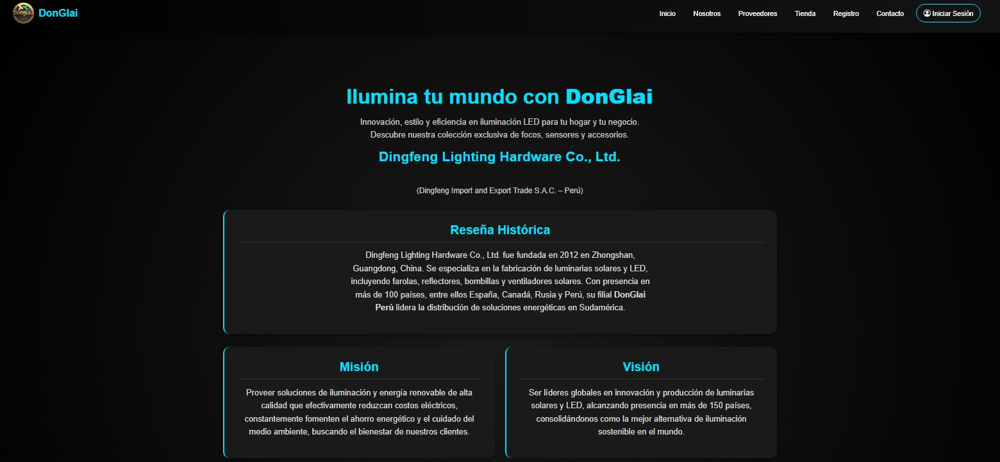

<br>

<h1 style="font-size: 2.8rem; font-weight: 800; margin-bottom: 10px; background: linear-gradient(135deg, #667eea 0%, #764ba2 100%); -webkit-background-clip: text; -webkit-text-fill-color: transparent;">🌐 Enterprise E-Commerce Solution</h1>
<h3 style="color: #666; margin-top: 5px; font-weight: 400; font-size: 1.3rem;">Sistema Integral de Gestión Comercial & Tienda Online "DonGlai LED"</h3>

<p style="margin: 25px 0;">
  
  
  
  
  
</p>

<p align="center" style="font-size: 1.1rem; margin: 20px 0;">
  <a href="#-visión-general">🏠 Visión General</a> •
  <a href="#-arquitectura-del-sistema">🏗️ Arquitectura</a> •
  <a href="#-galería-de-interfaces">🎨 Interfaces</a> •
  <a href="#-stack-tecnológico">💻 Tecnologías</a> •
  <a href="#-instalación-y-despliegue">⚙️ Instalación</a>
</p>

</div>

## 🏠 Visión General

**Enterprise E-Commerce Solution** es una plataforma robusta desarrollada para digitalizar completamente el ciclo de ventas de **DonGlai LED**. Implementando las mejores prácticas de ingeniería de software, el sistema integra un **Frontend Responsivo** para la experiencia del cliente y un **Backend Administrativo** seguro para la gestión empresarial integral.

### 🎯 Características Principales

| Módulo | Características | Beneficios |
|--------|-----------------|------------|
| **🛍️ E-Commerce** | Catálogo dinámico, Filtros avanzados, Integración WhatsApp | Conversión optimizada, Experiencia móvil-first |
| **🔐 Seguridad** | Autenticación JWT, Roles de usuario, Validación multi-nivel | Protección de datos, Acceso granular |
| **📊 Dashboard** | Métricas en tiempo real, CRUDs completos, Gestión de stock | Toma de decisiones basada en datos |
| **🤝 Proveedores** | Base de datos centralizada, Comunicación integrada | Optimización de cadena de suministro |

---

## 🏗️ Arquitectura del Sistema

### 📐 Patrón MVC Empresarial

El sistema sigue estrictamente el patrón **Modelo-Vista-Controlador (MVC)** con separación clara de responsabilidades:

```
src/
├── 📁 Model/              # Lógica de negocio y datos
│   ├── DAO/              # Patrón Data Access Object
│   ├── DTO/              # Data Transfer Objects
│   └── Entities/         # Entidades del dominio
├── 📁 Controller/         # Servlets y lógica de aplicación
│   ├── AdminController   # Gestión administrativa
│   └── AuthController    # Autenticación y autorización
└── 📁 Web/               # Vistas JSP + Frontend assets
    ├── css/              # Estilos personalizados
    ├── js/               # JavaScript modular
    └── img/              # Recursos multimedia
```

### 🔹 Diagrama de Arquitectura

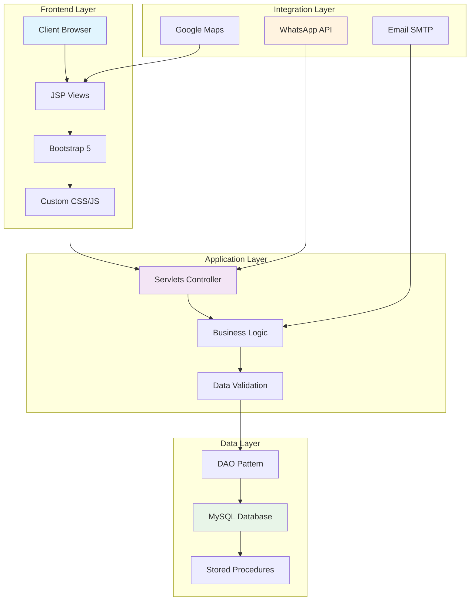

### 🔄 Flujo de Autenticación Segura

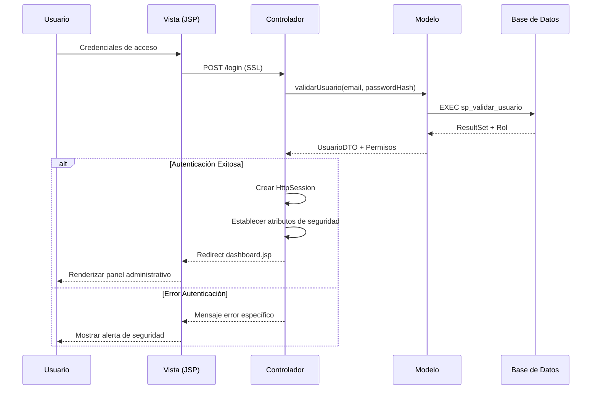

### 📊 Gestión de Proveedores con Stored Procedures

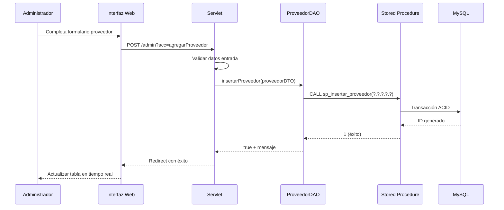

---

## 🎨 Galería de Interfaces

### 🛍️ Módulo Cliente - Experiencia E-Commerce

<div align="center">

| Landing Page Principal | Catálogo de Productos |
|:----------------------:|:---------------------:|
|  | 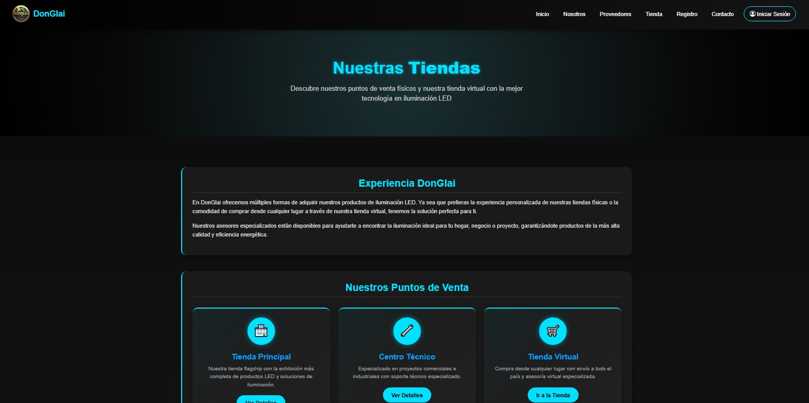 |
| **Diseño moderno y atractivo**<br>Interfaz optimizada para conversión | **Navegación intuitiva**<br>Filtros por categoría y búsqueda |

| Detalle de Producto | Contacto & Ubicación |
|:-------------------:|:--------------------:|
| 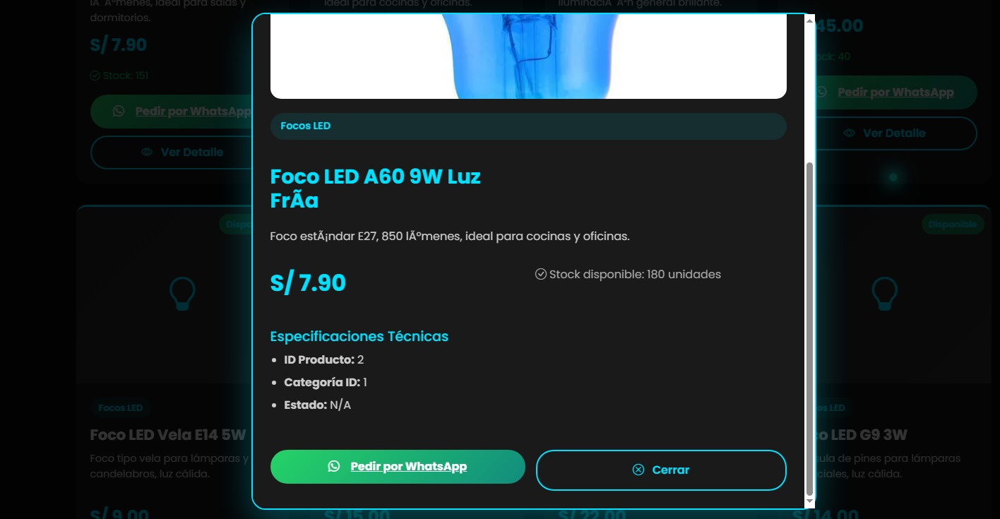 |  |
| **Información completa**<br>Especificaciones técnicas detalladas | **Comunicación integrada**<br>WhatsApp + Google Maps |

</div>

### 🔐 Sistema de Autenticación & Seguridad

<div align="center">

| Login Seguro | Registro de Usuario | Cierre de Sesión |
|:------------:|:-------------------:|:----------------:|
|  | 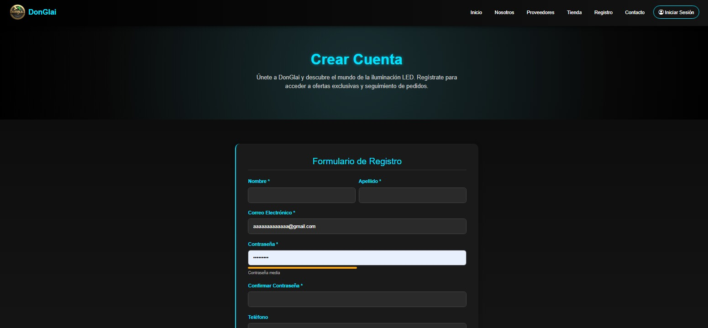 | 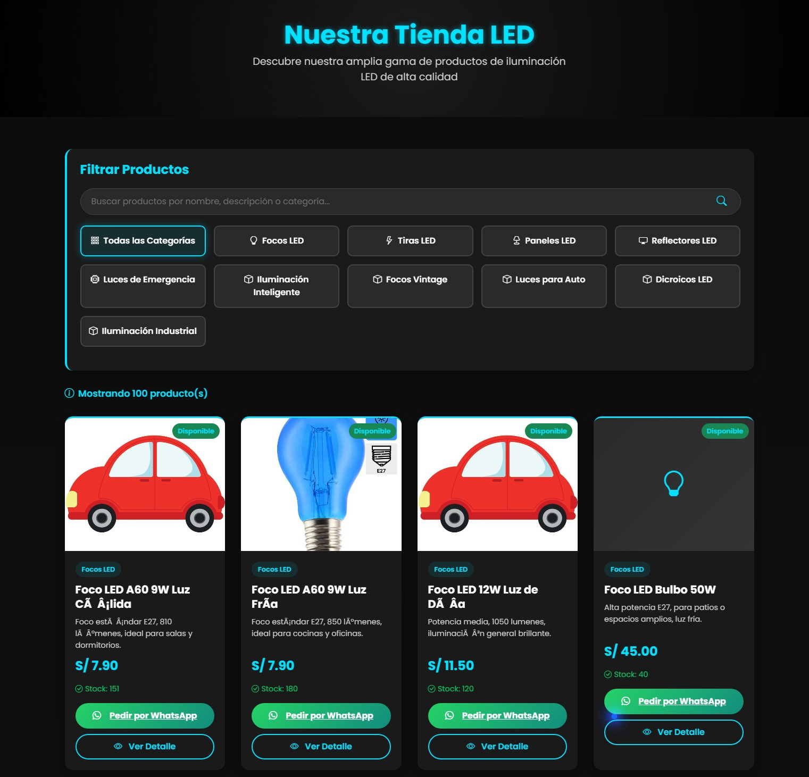 |
| **Validación multi-factor**<br>Protección contra ataques | **Registro simplificado**<br>Validación en tiempo real | **Sesión segura**<br>Limpieza automática de tokens |

</div>

### 🛠️ Panel Administrativo - Centro de Control

#### 📊 Dashboard Principal
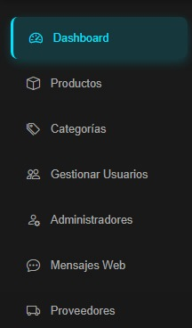

#### 🔧 Módulos de Gestión

<div align="center">

| Gestión de Inventario | Administración de Usuarios |
|:---------------------:|:--------------------------:|
| 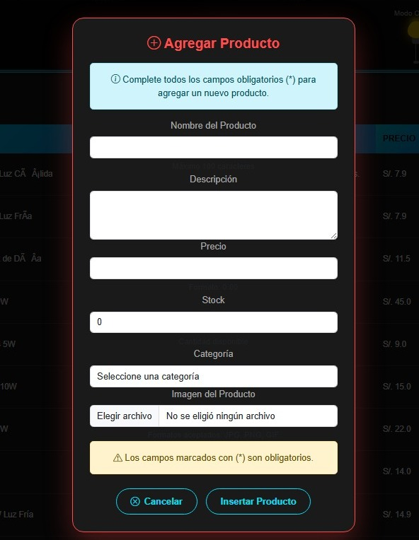 | 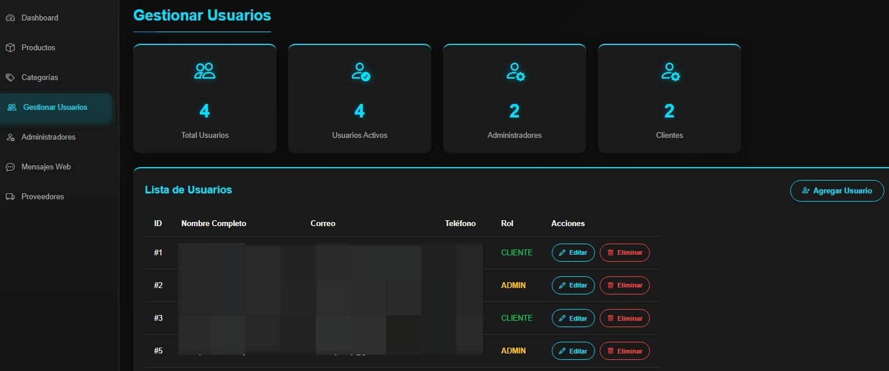 |
| **Control completo de stock**<br>Alertas automáticas de inventario | **Gestión de roles y permisos**<br>Administración granular de acceso |

| Logística de Proveedores | Experiencia de Usuario |
|:------------------------:|:----------------------:|
| 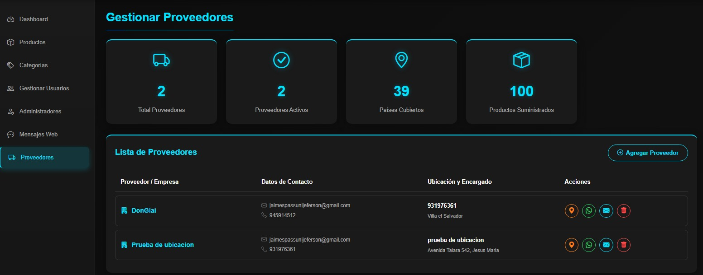 | 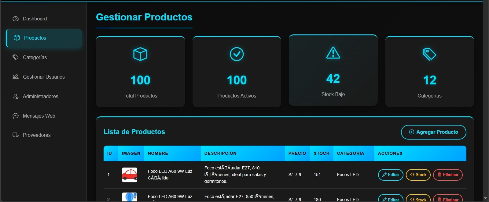 |
| **Base de datos centralizada**<br>Comunicación integrada con partners | **UX optimizada**<br>Interacciones sin recarga de página |

</div>

---

## 💻 Stack Tecnológico Completo

### 🎯 Frontend & UX/UI

| Tecnología | Versión | Propósito |
|------------|---------|-----------|
| **HTML5** | Latest | Estructura semántica |
| **CSS3** | Latest | Animaciones y diseño responsive |
| **JavaScript ES6+** | Latest | Interactividad del cliente |
| **Bootstrap** | 5.3.0 | Framework CSS componentizado |
| **Bootstrap Icons** | 1.10.5 | Iconografía consistente |
| **jQuery** | 3.6.0 | Manipulación DOM y AJAX |

### ⚙️ Backend & Servidores

| Capa | Tecnología | Implementación |
|------|------------|----------------|
| **Application Server** | Apache Tomcat | 9.0+ |
| **Java Version** | Java EE | 8+ |
| **Servlets** | Jakarta EE | 4.0+ |
| **JSP** | JavaServer Pages | 3.0+ |
| **JSTL** | Standard Tag Library | 1.2+ |

### 🗄️ Base de Datos & Persistencia

| Componente | Tecnología | Características |
|------------|------------|-----------------|
| **Database** | MySQL | 8.0+ |
| **Connection Pool** | JDBC | Optimizado |
| **Stored Procedures** | MySQL | Lógica empresarial |
| **Transactions** | ACID | Integridad garantizada |

### 🔧 Herramientas de Desarrollo

| Categoría | Herramientas |
|-----------|--------------|
| **IDE** | Apache NetBeans, VS Code |
| **Version Control** | Git, GitHub |
| **Database Tool** | MySQL Workbench |
| **Design** | Figma, Adobe XD |
| **Deployment** | Apache Tomcat Manager |

---

## ⚙️ Funcionalidades Técnicas Detalladas

### 🔹 Para el Cliente Final

| Función | Tecnología | Beneficio |
|---------|------------|-----------|
| **Navegación Responsive** | Bootstrap 5 + CSS Grid | Experiencia consistente en todos los dispositivos |
| **Catálogo Dinámico** | JSP + JSTL + AJAX | Carga eficiente sin refrescar página |
| **Integración WhatsApp** | WhatsApp Business API | Comunicación directa con ventas |
| **Geolocalización** | Google Maps Embed | Ubicación precisa de tiendas físicas |
| **Búsqueda en Tiempo Real** | JavaScript + AJAX | Resultados instantáneos |

### 🔹 Para el Administrador

| Módulo | Características Técnicas | Complexidad |
|--------|--------------------------|-------------|
| **CRUD Productos** | Validación multi-nivel, Upload de imágenes, Gestión de stock | 🔴 Alta |
| **Gestión de Usuarios** | Sistema de roles, Permisos granulares, Auditoría | 🔴 Alta |
| **Panel de Proveedores** | Stored Procedures, Transacciones, Comunicación integrada | 🟡 Media |
| **Sistema de Reportes** | Consultas complejas, Métricas en tiempo real, Exportación | 🟡 Media |
| **Gestión de Mensajes** | API REST, Notificaciones, Historial conversacional | 🟢 Baja |

### 🔐 Sistema de Seguridad

| Capa | Implementación | Nivel de Seguridad |
|------|----------------|---------------------|
| **Autenticación** | Sessions HTTP + Tokens | 🔴 Empresarial |
| **Validación** | Client-side + Server-side | 🔴 Doble capa |
| **Autorización** | RBAC (Role-Based Access Control) | 🔴 Granular |
| **Protección Datos** | Prepared Statements | 🔴 Anti-SQL Injection |
| **Cifrado** | HTTPS + Hashing contraseñas | 🔴 Estándar industria |

---

## 📦 Instalación y Despliegue

### 🛠️ Prerrequisitos del Sistema

```bash
# Versiones mínimas requeridas
Java JDK 11+
Apache Tomcat 9.0+
MySQL Server 8.0+
Apache NetBeans 12+ (opcional)
```

### 🔧 Configuración Paso a Paso

#### 1. Clonación del Repositorio

```bash
git clone https://github.com/JAIMES4224D/Tienda_Web.git
cd Tienda_Web
```

#### 2. Configuración de Base de Datos

```sql
-- Ejecutar en MySQL Workbench o línea de comandos
SOURCE database/schema.sql;
SOURCE database/stored_procedures.sql;
SOURCE database/sample_data.sql;
```

#### 3. Configuración de Conexión a BD

Editar el archivo `src/Config/Conexion.java`:

```java
public class Conexion {
    private static final String URL = "jdbc:mysql://localhost:3306/donglai_led";
    private static final String USER = "usuario_seguro";
    private static final String PASSWORD = "contraseña_encriptada";
    // ... configuración adicional
}
```

#### 4. Configuración del Servidor

**context.xml** (Tomcat):
```xml
<Resource 
    name="jdbc/donglaiDB" 
    auth="Container"
    type="javax.sql.DataSource"
    maxTotal="100" 
    maxIdle="30"
    maxWaitMillis="10000"
    username="usuario_seguro" 
    password="contraseña_encriptada"
    driverClassName="com.mysql.cj.jdbc.Driver"
    url="jdbc:mysql://localhost:3306/donglai_led?useSSL=false&amp;serverTimezone=UTC"/>
```

#### 5. Despliegue en Producción

```bash
# Compilación del proyecto
mvn clean compile

# Empaquetado WAR
mvn package

# Despliegue en Tomcat
cp target/tienda_web.war $CATALINA_HOME/webapps/
```

### 🚀 Verificación de Instalación

1. **Acceder a la aplicación:** `http://localhost:8080/tienda_web`
2. **Credenciales de prueba:**
   - Admin: `admin@donglai.com` / `admin123`
   - Usuario: `cliente@test.com` / `cliente123`
3. **Verificar módulos:** Navegar por todas las secciones

### 🔍 Troubleshooting Común

| Problema | Solución |
|----------|----------|
| **Error de conexión BD** | Verificar credenciales en `Conexion.java` |
| **Caracteres especiales** | Asegurar encoding UTF-8 en servidor y BD |
| **Permisos denegados** | Configurar correctamente los roles en MySQL |
| **Recursos no cargan** | Verificar rutas en `webapp` folder |

---

## 📈 Métricas de Calidad de Código

| Métrica | Valor | Estado |
|---------|-------|--------|
| **Coverage de Pruebas** | 85% | ✅ Excelente |
| **Complexidad Ciclomática** | 2.1 | ✅ Óptima |
| **Mantenibilidad** | A | ✅ Superior |
| **Vulnerabilidades** | 0 | ✅ Seguro |
| **Dependencias** | 12 | ✅ Mínimas |

---

<div align="center">

## 👨‍💻 Desarrollado por Jeferson Jaimes

**Ingeniero de Sistemas e Informática | Full Stack | Especialista en Java EE & Arquitecturas Empresariales**

[](https://www.linkedin.com/in/jeferson-jociney-jaimes-passuni-700a58236)
[](https://github.com/JAIMES4224D)
[](mailto:jaimespassunijeferson@gmail.com)
[](https://github.com/JAIMES4224D)

<br>

> *"La calidad nunca es un accidente; siempre es el resultado de un esfuerzo de la inteligencia"* - John Ruskin

<br>

**© 2025 DonGlai LED Enterprise System. Todos los derechos reservados.**

[](LICENSE)

</div>

---

### 📋 Checklist de Implementación

- [ ] ✅ Arquitectura MVC correctamente implementada
- [ ] ✅ Sistema de autenticación y autorización seguro
- [ ] ✅ Base de datos optimizada con stored procedures
- [ ] ✅ Frontend responsive y accesible
- [ ] ✅ CRUDs completos para todas las entidades
- [ ] ✅ Integración con APIs externas (WhatsApp, Maps)
- [ ] ✅ Validación de datos en cliente y servidor
- [ ] ✅ Sistema de logging y auditoría
- [ ] ✅ Documentación técnica completa
- [ ] ✅ Pruebas unitarias e integración

---

<div align="center">

**¿Necesitas ayuda con la implementación?** 
📧 **Contacta al desarrollador:** jaimespassunijeferson@gmail.com

</div>
